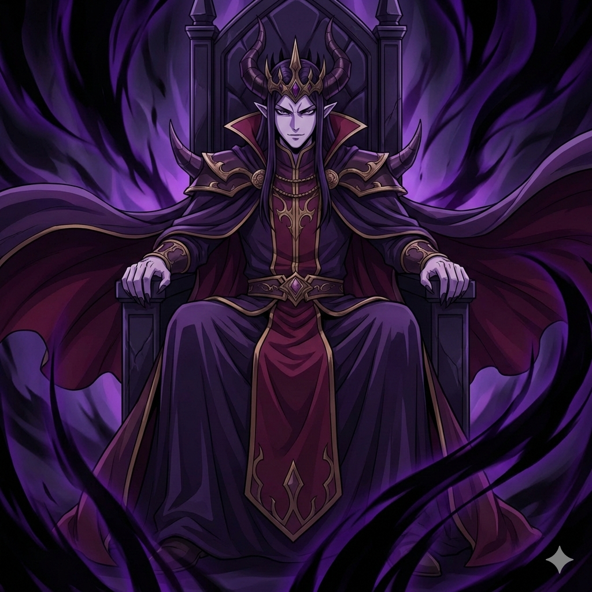
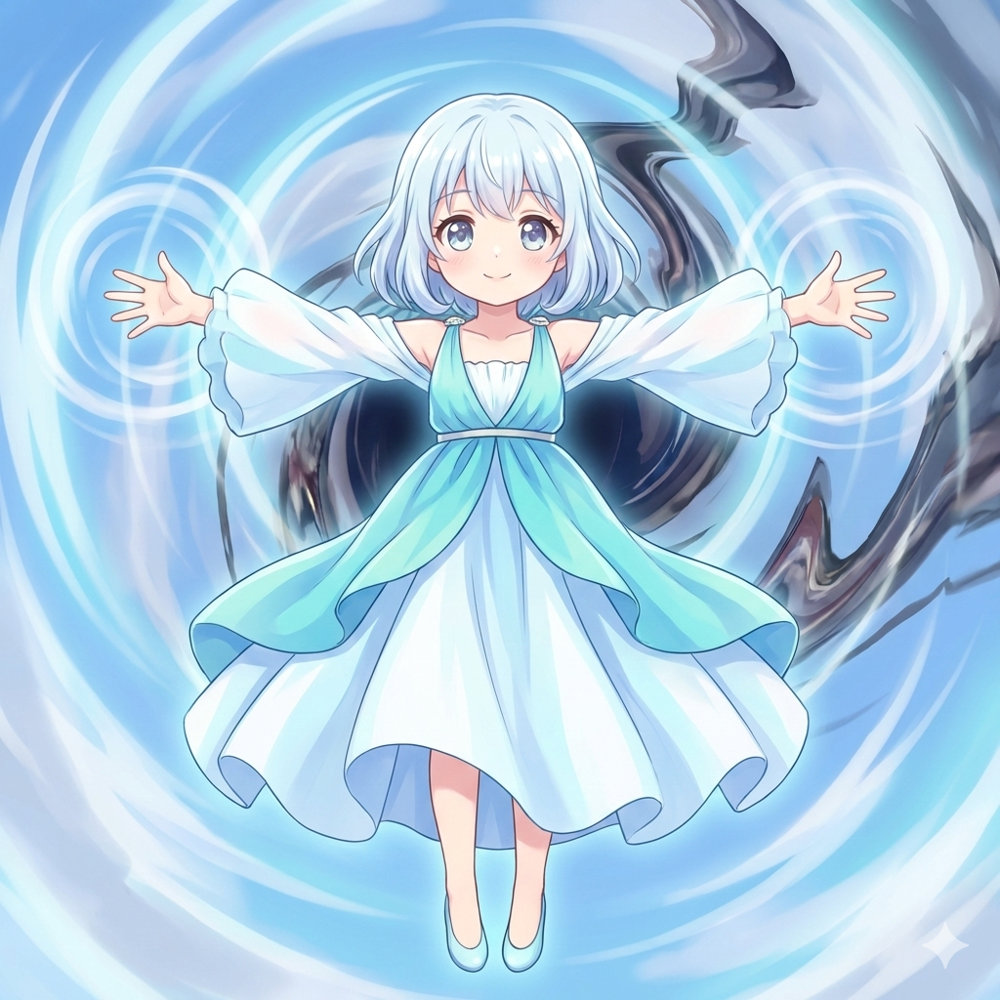
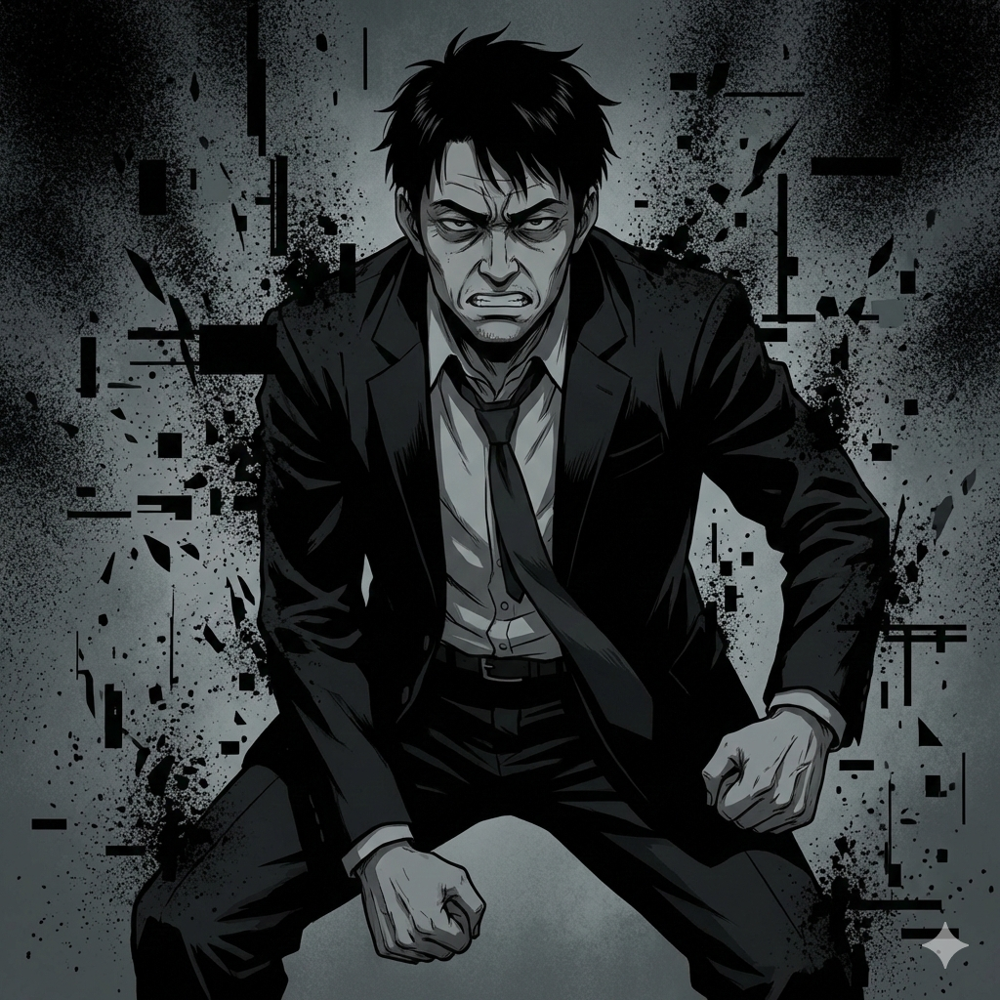
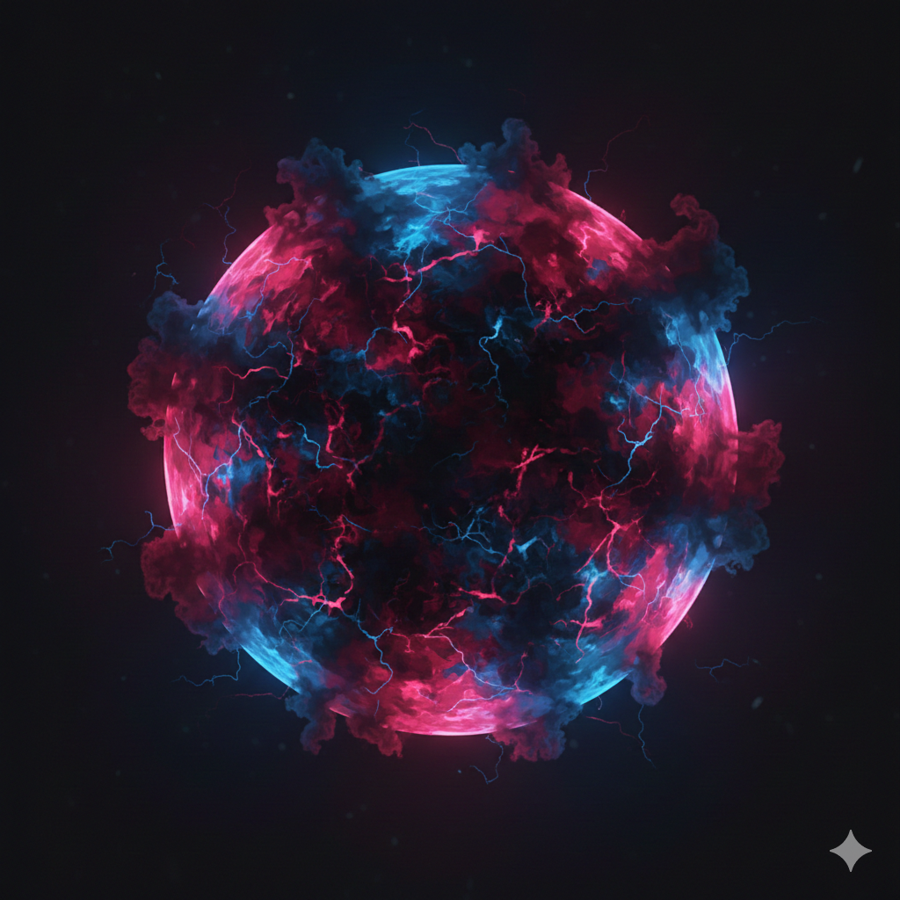

## 1. ゲーム概要

- タイトル：異世界決戦：三界衝突（トライ・クラッシュ）
- ジャンル：リアルタイム・バランスアクション
- 対象プラットフォーム：Webブラウザ
- 想定プレイ時間：3〜5分
- 対象年齢：10〜30代
- 使用技術：HTML / CSS / JavaScript
- 描画方式：Canvas または DOM + CSS Animation
- セーブ機能：なし（スコアのみ localStorage 可）

---

## 2. 世界観・前提

レオン（魔王）、女神、佐藤武志の三者は、
互いに**殺意をもって最終必殺技を放ち合っている**。

和解・会話・協力は存在しない。
三つの力は衝突し、世界そのものを崩壊させようとしている。

プレイヤーは三者のいずれでもなく、
**崩壊の中心に発生した「均衡点」を操作する存在**として介入する。

---

## 3. 基本コンセプト（重要）

### ❌ 不採用
- 数値ゲージ
- HPバー
- 明示的な数値管理UI

### ✅ 採用
- 見た目・動き・音による「バランス感覚」
- 押される／歪む／耐えるという物理的感覚
- 数値はすべて内部処理のみ（非表示）

---

## 4. 画面構成

### メイン画面

```
       🔴 レオンの圧力（赤）
                ↓
    ┌───────────────────┐
    │                   │
🟦 女神の干渉 → │ ⚫ 崩壊核（コア） │ ← ⚫ 佐藤の無圧
│ （歪む不定形球体） │
│ │
└───────────────────┘
↑
佐藤の侵食圧
```

- 左：女神（青）の干渉波
- 右：佐藤武志（黒）の無圧侵食
- 上：レオン（赤）の破壊圧力
- 中央：崩壊核（バランスの中心）

### 画面素材（紐づけ）
| 位置 | 画像 | ファイル |
| --- | --- | --- |
| 上（レオン） |  | `picture/maou.png` |
| 左（女神） |  | `picture/megami.png` |
| 右（佐藤武志） |  | `picture/takesi.png` |
| 中央（崩壊核） |  | `picture/ball.png` |

---

## 5. 中央オブジェクト：崩壊核（Collapse Core）

### 見た目仕様
- 球体だが常に歪む
- 三色（赤・青・黒）が混ざり合う
- 偏った方向に引き延ばされる
- 危険度が高いほど振動・拡大・発光が激化

### 参照画像


### 内部パラメータ（非表示）
```
forceLeon    // レオンの破壊圧力
forceGoddess // 女神の干渉力
forceSato    // 佐藤の無圧侵食
stability    // 全体安定度
```

---

## 6. 操作方法

### 共通操作思想
操作＝数値調整ではなく「力を受け流す・押し返す・一瞬耐える」行為

### PC操作
| 操作 | 内容 |
| --- | --- |
| Aキー | レオンの圧力を弾く |
| Sキー | 女神の干渉を逸らす |
| Dキー | 佐藤の無圧を押し戻す |
| スペース / クリック | 崩壊核を一瞬固定 |

### スマホ操作
| 操作 | 内容 |
| --- | --- |
| 左スワイプ | レオン圧力を弾く |
| 右スワイプ | 女神干渉を逸らす |
| 下スワイプ | 佐藤無圧を押し戻す |
| 中央タップ | 崩壊核を一瞬固定 |

※ 連打・連続操作にはペナルティあり

---

## 7. タイミング要素（リズム性）
崩壊核は不規則な脈動を持つ

脈動のピークで中央タップすると安定度上昇

失敗すると大きく歪む

```
pulse = Math.sin(time * speed + randomOffset)
```

---

## 8. バランス崩壊の演出段階
軽度不安定
コアが歪む

特定色が強くなる

警告SE

危険域
画面シェイク

操作受付時間短縮

ノイズ演出

臨界突破
コア爆発／無化

即エンディング遷移

---

## 9. 三者の特性
| キャラ | 特性 |
| --- | --- |
| レオン | 直線的で強い破壊圧 |
| 女神 | 波状・揺さぶり型干渉 |
| 佐藤武志 | 突発・ランダム・理不尽 |

### キャラ画像
| キャラ | 画像 | ファイル |
| --- | --- | --- |
| レオン |  | `picture/maou.png` |
| 女神 |  | `picture/megami.png` |
| 佐藤武志 |  | `picture/takesi.png` |

---

## 10. 勝敗条件
### 勝利
- 制限時間（例：90秒）まで `stability` が破綻せず維持される

### 敗北
- `stability` が臨界値以下
- 崩壊核が完全崩壊

---

## 11. ランク評価
| ランク | 内容 |
| --- | --- |
| S | 完全制御（世界のみ残る） |
| A | 二者相殺 |
| B | 世界半壊 |
| C | 世界崩壊・三者存続 |
| D | 世界無化 |

※ ランクごとに専用エンディング再生

12. 技術仕様補足
ゲームループ：requestAnimationFrame

フレームレート：60fps

数値UI表示：なし

難易度：時間経過で圧力増加

サウンド：色ごとに専用SE

13. ゲームの面白さ
数値を見ない直感的バランス操作

常に崩れそうな緊張感

三者の殺意を「圧力」として体感

上達すると視覚・音だけで判断可能

## 14.x キャラクター画像仕様（詳細版 / Gemini生成用）

本ゲームのキャラクター画像は **アニメ調イラスト** を前提とする。  
リアル寄り・写実系は禁止し、「色・表情・シルエットで性格が一瞬で分かる」ことを最優先とする。

## 14.x.2 女神キャラクター仕様  
### ――「かわいい」「危うい」「殺意を内包した愛らしさ」

### 基本設定
- 種族：女神
- 立場：最終兵器ラームブリアンの使い手
- 性格表現：無邪気さと冷酷さの同居

### ビジュアル指針
- **かわいいアニメ絵を最優先**
- 顔立ち：丸みのある輪郭、大きな瞳
- 表情：微笑み／無垢な笑顔（戦闘中でも）
- ポーズ：浮遊・両手を広げる・兵器制御中
- シルエット：細身・軽やか

### 色・演出
- メインカラー：青・水色・白
- オーラ：波状・円形・柔らかい光
- 危険表現：かわいいまま、背景が歪む

### サイズ・形式
- 推奨サイズ：512x512 px
- 形式：PNG（背景透過）

## 14.x.3 佐藤武志キャラクター仕様  
### ――「たけだけしさ」「異物感」「人間なのに一番怖い」

### 基本設定
- 種族：現代人間
- 職業：会社員
- 立場：無の波動を放つ異常存在
- 性格表現：感情不明・暴力的圧迫感

### ビジュアル指針
- アニメ調だが**ヒーロー感は出さない**
- 顔立ち：彫り深め・疲れた目
- 表情：無表情 or 歯を食いしばった険しい顔
- ポーズ：拳を握る／前傾姿勢
- シルエット：重心低め・圧迫感重視

### 服装
- 現代日本のスーツ（ネクタイ乱れ可）
- 服は普通、**存在だけが異常**

### 色・演出
- メインカラー：黒・暗灰
- オーラ：黒いノイズ・空間欠損・粒子崩壊
- 音が無いように見える演出

### サイズ・形式
- 推奨サイズ：512x512 px
- 形式：PNG（背景透過）

## 14.x.4 魔王キャラクター画像仕様（Gemini生成用・最上位存在）

本作に登場する「魔王」は、  
レオンとは完全に別人物であり、**戦士ではなく“世界の支配者”そのもの**として描写する。

戦場に立つ存在ではなく、  
存在するだけで世界の法則を歪めている“格上の存在”。

---

### ■ 魔王のコンセプト

- キーワード  
  **「絶対支配」「王としての威厳」「抗えない恐怖」「美しさすらある邪悪」**
- 感情表現  
  - 怒り：不要  
  - 焦り：皆無  
  - 表情：余裕・嘲笑・見下ろし
- 世界観上の立ち位置  
  - 世界はすでに“掌の上”
  - 戦わずとも支配が成立している

---

### ■ ビジュアル指針（最重要）

#### 絵柄
- 高品質アニメイラスト
- 美形寄りだが冷酷
- 「敵キャラ」ではなく「ラスボス級存在」

#### 顔・表情
- 切れ長の目、鋭い視線
- 薄く笑う、もしくは完全無表情
- プレイヤーを見下ろす構図

#### ポーズ・構図
- 玉座に座る／宙に浮く／背後に巨大な影
- 体の動きは少ない（動かない＝支配者）
- カメラはやや下から（ローアングル）

---

### ■ 色・エフェクト設計

| 要素 | 指針 |
|---|---|
| メインカラー | 漆黒・深紫・暗赤 |
| サブカラー | 金・深紅 |
| オーラ | 重力を感じる暗黒波動 |
| エフェクト | 空間歪曲・影の揺らぎ |
| 光り方 | 鈍く、重く、逃げ場がない |

※ 派手に光らせない  
※ 「明るい＝強い」は禁止  
→ **暗いのに圧倒的に強そう** が正解

---

### ■ 服装・装備

- 王冠 or 角（どちらか、または融合）
- 長いマント（重力を無視して垂れる）
- 装飾は多すぎない（余裕の象徴）
- 武器は「持っていない」か「象徴的なもののみ」

---

### ■ サイズ・形式

- 推奨サイズ：**768x768 px**
  - 他キャラより一回り大きく
- 形式：PNG（背景透過）
- UI使用時は縮小表示（格の違いを演出）


### 14.3 中央オブジェクト：崩壊核（Collapse Core）

| 用途 | 内容 | サイズ | 備考 |
|---|---|---|---|
| 崩壊核 | 不定形エネルギー球 | 512x512 | CSS/Canvasで歪ませる前提 |

- 赤・青・黒が混ざった球体
- 形が安定していない
- 輪郭が曖昧

